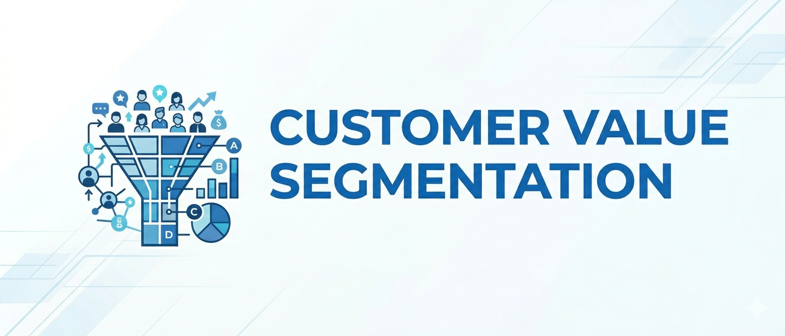
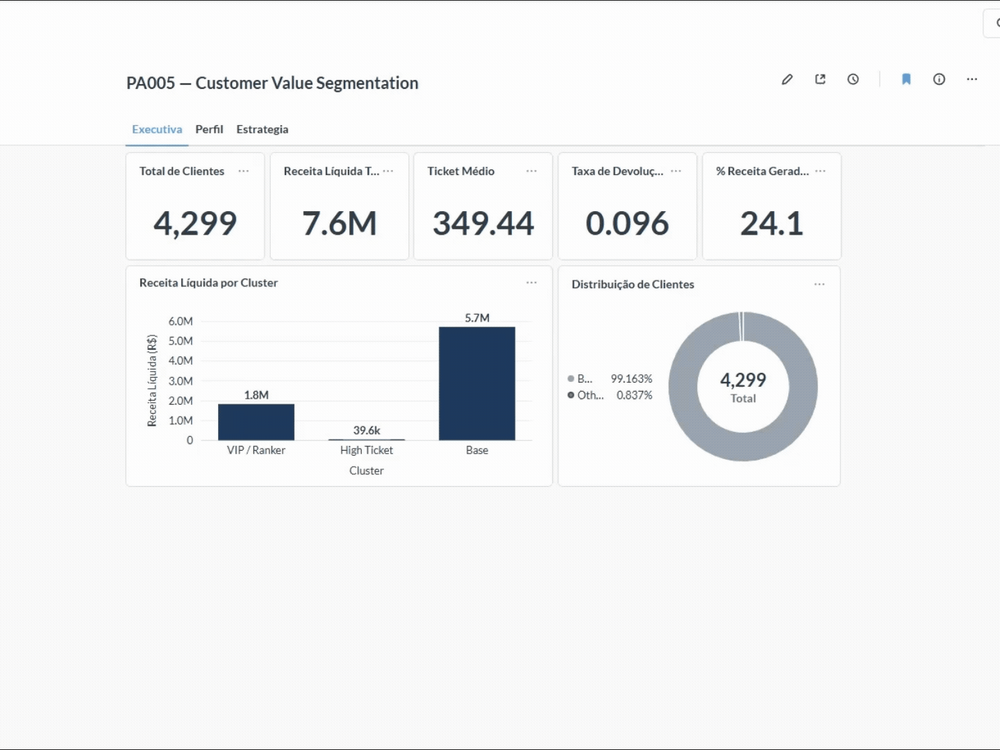
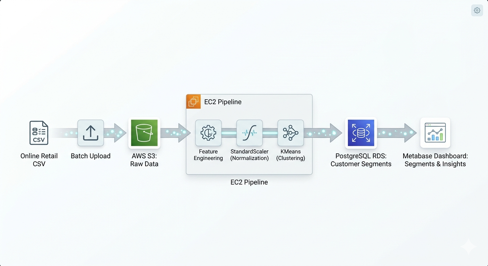

# PA005 — Customer Value Segmentation

> Segmentação de clientes de e-commerce com Machine Learning, deploy em AWS e dashboard interativo via Metabase.

---

## 1. Business Problem / Context

Uma empresa fictícia de e-commerce acumulava uma base crescente de clientes, mas operava sem visibilidade sobre **quem eram seus clientes mais valiosos**, como eles se comportavam e quais estavam em risco de abandono.

Sem essa visibilidade, decisões de marketing, retenção e alocação de recursos eram tomadas de forma genérica, tratando clientes de R$264k de receita da mesma forma que clientes de R$300.

**Dor central:** ausência de segmentação comportamental impedia estratégias diferenciadas de retenção e crescimento.

**Impacto esperado:** identificar grupos de clientes com comportamentos distintos, permitindo ações de negócio direcionadas, programas de fidelidade para VIPs, campanhas de reativação para inativos e estratégias de crescimento para a base intermediária.

---

## 2. Business Goal / Objective

**Objetivo analítico:** segmentar a base de clientes em grupos homogêneos com base em comportamento de compra, utilizando técnicas de clusterização não supervisionada.

**O que a solução entrega:**
- Identificação de clientes de alto valor ("Rankers / VIP")
- Perfil comportamental de cada segmento
- Recomendações de ação por cluster
- Pipeline produtivo deployado em cloud com dashboard executivo

**Critério de sucesso:** clusters com Silhouette Score acima de 0.40, interpretáveis do ponto de vista de negócio e viáveis para deploy em ambiente cloud com recursos limitados.

---

## 3. Dataset Description

O projeto utiliza o Online Retail Dataset (UCI / Kaggle), contendo transações reais de um e-commerce do Reino Unido.

Após limpeza e tratamento:
- ~4.300 clientes únicos
- dados transacionais históricos
- invoices, produtos, preços, quantidades e datas de compra

Invoices canceladas (`InvoiceNo` iniciando com `C`) foram tratadas separadamente como devoluções.

---

## 4. Solution Strategy

A solução segue o framework **CRISP-DM** adaptado para projetos de clusterização com deploy em cloud:

```
Business Understanding
       ↓
Data Collection (S3)
       ↓
Data Cleaning & Preparation
       ↓
Feature Engineering (17 features comportamentais)
       ↓
EDA & Business Hypotheses
       ↓
Modeling (KMeans, GMM, H-Clustering, DBSCAN + embeddings)
       ↓
Evaluation (Silhouette Score + interpretabilidade de negócio)
       ↓
Deploy (EC2 + RDS PostgreSQL + Metabase Dashboard)
```

**Separação explícita treino vs inferência:**

| Módulo | Arquivo | Responsabilidade |
|---|---|---|
| Treino | `src/train_model.py` | Feature engineering + StandardScaler + KMeans → `.pkl` |
| Inferência | `src/predict_model.py` | Carrega modelos → gera clusters → persiste no RDS |

---

## 5. Data Cleaning / Data Preparation

- Remoção de registros sem `CustomerID`
- Correção de tipos de dados (`InvoiceDate` → datetime)
- Remoção de duplicatas
- Filtragem de `UnitPrice < 1`, reduzindo itens promocionais/brindes sem relevância analítica
- Limpeza semântica de `StockCode`, removendo códigos administrativos, brindes, ajustes internos e registros sem significado comercial
- Separação de invoices canceladas (`InvoiceNo` iniciando com `C`) em uma base específica de devoluções
- Criação de métricas de devolução (`return_rate`, `return_value`, `return_value_ratio`)
- Criação de `net_revenue` considerando impacto financeiro das devoluções
- Remoção de clientes com:
  - `net_revenue <= 0`
  - `return_value_ratio >= 0.95`

> Foram removidos 15 clientes (~0.35% da base) com comportamento incompatível com análise de valor, representando compras integralmente devolvidas ou financeiramente negativas.

---

## 6. Feature Engineering

Principais grupos de features:
- Receita e valor (`gross_revenue`, `avg_ticket`, `net_revenue`)
- Frequência e recência (`frequency`, `recency_days`)
- Velocidade de consumo (`revenue_velocity`, `items_velocity`)
- Fidelidade e comportamento (`product_loyalty`, `basket_size`)
- Devoluções e risco (`return_rate`, `return_value_ratio`)

> Total de 17 features customer-level utilizadas na clusterização. A feature `revenue_velocity` foi a mais relevante na separação dos clusters.

---

## 7. Exploratory Data Analysis (EDA)

**Hipóteses validadas:**

| Hipótese | Resultado |
|---|---|
| Poucos clientes concentram a maior parte da receita | ✅ Confirmado — 35 VIPs (0,8% da base) geram 24% da receita |
| Clientes frequentes possuem ticket médio maior | ✅ Confirmado — VIPs: 36 compras / R$2.302 de ticket médio |
| Taxa de devolução diferencia os clusters | ✅ Confirmado — High Ticket apresenta maior return_rate (0.25) |
| `revenue_velocity` separa bem os perfis | ✅ Confirmado — feature mais discriminante na clusterização |

---

## 8. Modeling / Machine Learning

### Comparação Experimental de Modelos (Silhouette Score)

| Modelo | Melhor Score | K ótimo |
|---|---|---|
| KMeans | 0.722 | 12 |
| GMM | 0.720 | 11 |
| Hierarchical Clustering | 0.719 | 12 |
| DBSCAN | 0.672 | 10 |

> O pré-processamento com embeddings (RandomForest leaf embeddings + UMAP) melhorou significativamente a separação entre clusters em todos os algoritmos avaliados.

> Esses scores são do experimento com embeddings. A versão de produção (StandardScaler → KMeans, sem embeddings) não teve o Silhouette registrado aqui.

Para produção, foi adotado:

`StandardScaler → KMeans`

A escolha priorizou:
- simplicidade operacional;
- estabilidade de deploy;
- interpretabilidade de negócio.


---

## 9. Business Results / Insights



**Principais descobertas:**

- **35 clientes VIP** (0,8% da base) geram **24% de toda a receita** — concentração de valor extrema, típica de Pareto
- O **cliente top** (ID 14.646) gerou **R$264.747** com 71 compras — recência de apenas 1 dia
- **1.200 clientes da Base** estão em risco de churn (>120 dias sem comprar) — alvo imediato de campanha de reativação
- O cluster **High Ticket** (1 cliente, R$13k de ticket médio) apesar de representar apenas um cliente, o cluster foi mantido por apresentar comportamento extremamente distinto do restante da base.

**Ações recomendadas por cluster:**

| Cluster | Ação |
|---|---|
| VIP / Ranker | Programa de fidelidade, atendimento premium, ofertas exclusivas |
| High Ticket | Relacionamento personalizado, reengajamento, visita consultiva |
| Base (risco churn) | Campanha de reativação, cupons, email marketing segmentado |

---

## 10. Deploy / Production

### Arquitetura AWS




### Componentes

| Serviço | Função |
|---|---|
| **AWS S3** | Armazena o dataset bruto |
| **AWS EC2** | Executa o pipeline de inferência |
| **AWS RDS (PostgreSQL)** | Persiste a tabela clusterizada (`rankers`) |
| **Metabase** | Dashboard executivo com 3 abas navegáveis |

---

## 11. Conclusions / Next Steps

### Conclusões

Este projeto demonstrou como técnicas de clusterização não supervisionada podem gerar valor de negócio concreto em um contexto de CRM e segmentação de clientes.

A limitação técnica da EC2 free tier impôs uma simplificação no pipeline produtivo.

### Próximos Passos

- [ ] **Cronjob na EC2** — agendamento automático do `predict_model.py` para atualização diária dos clusters
- [ ] **Churn prediction** — modelo supervisionado para prever probabilidade de churn por cliente
- [ ] **Recommendation system** — recomendação de produtos baseada no perfil do cluster
- [ ] **Pipeline de retreinamento** — retraining automático do KMeans em janelas temporais

---

## Technologies


| Categoria | Tecnologias |
|---|---|
| **Linguagem** | Python 3.11 |
| **ML** | Scikit-learn, UMAP (experimental) |
| **Data** | Pandas, NumPy, SQLAlchemy |
| **Cloud** | AWS EC2, AWS S3, AWS RDS |
| **Banco** | PostgreSQL |
| **Dashboard** | Metabase |
| **Ambiente** | Jupyter Notebook, VSCode |

---
